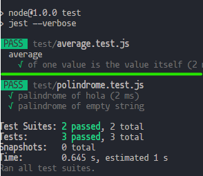

# TESTING 

Que es el testing? _"El testing es una herramienta de feedback que permite detectar errores en el proceso de desarrollo para poder solucionarlos a tiempo. Se puede describir como el proceso de verificación y validación de una aplicación 1. Es una disciplina en la ingeniería de software que permite tener procesos, métodos de trabajo y herramientas para identificar defectos en el software alcanzando un proceso de estabilidad del mismo "._-CHAT bing 
en pocas palabras puedes detectar errores en el codigo emular que pasaria si tal dato no llegara

por ejemplo tenemos el siguiete codigo 
```javascript
    const suma = (a, b) => {
        return a - b
    }
```

este copdigo esta mal porque no regresa lo que esperamos entonces lo que hariamos en un entorno de Testing seria 

```javascript
if (suma(1, 3) !== 4) {
  console.log('suma of 1 and 3 expected to be 4')
}
```

y haci probando diferentes casos este es un caso muy basico para entender la forma de hacer testing basico

pero este codigo todabia se puede mejorar usando 

### console.assert()

console.assert nos debuelve el error que pongamos si la sentencia es falsa 


 ```javascript
    const suma = (a, b) => {
        return a - b
    }

    console.assert(
  suma(1, 3) === 4, 'error'
)
```

este codigo lo podriamos factorizar de la siguiente manera
```javascript
const suma = (a, b) => {
  return a - b
}

const checks = [
  { a: 1, b: 1, result: 2 },
  { a: 1, b: 2, result: 3 },
  { a: 2, b: 2, result: 4 }

]

checks.forEach((element) => {
  const { a, b, result } = element
  console.assert(suma(a, b) === result, `${a} mas ${b} deberia dar ${result}`)
})
```
<FONT color="red">Nota: esto solo es un ejemplo para entender a grandes rangos lo que es el testing esto nunca se deberia de usar para aplicaciones reales </FONT>

## Usando JEST para hacer testing

Que es jest? jest es un pakete que nos ayudara ha acer test esta echo por facebook pero estaba pensado mas para el frontend que para el backend pero con el tiempo esto se ha ido generalisando para el backend haciendo que funcione igual para las dos partes

como usar jest? para usar jest solo tenemos que instalarlo como *dependencia de desarollo* con npm

otra cosa que teenmos que saber para empezar a usar jest es que en el package.json teenemos que especificar en que entorno queremos ejecutar jest por ejemplo en node seria de la siguiente manera 

```javascript
  "jest": {
    "testEnvironment": "node"
  }
}
```

## crendo el primer test con JEST

1. primero tenemos que crear un archivo que tenga la extension **.test.js** ya que JEST solo detecta estos archivos

2. iniciamos el test con la funcion **test()** y ponemos en el primer parametro lo que hace el test

```javascript
    //queremos verificar esta funcion
    const palindrome = (string) => {
        return string.split("").reverse().join("")
    }
    //===================================
    //queremos ver si funciona con la palabra hola
    test('verificar el palindrome de hola', () => {
    })
    
```

3. una vez inicido el test tenemos que recuperar en una variable el resultado de la funcion testiada y pasar lo que esperamos que regrese esa funcion

```javascript
    const palindrome = (string) => {
        return string.split("").reverse().join("")
    }
    //===================================
    //queremos ver si funciona con la palabra hola
    test('verificar el palindrome de hola', () => {
        const result = palindrome('hola')//recuperamos la respuesta de la funcion

        expect(result).toBe('aloh')//pasamos la expectativa y luego la verdadera que deve estar checkada por nosotros
    })
``` 

<FONT color="red">Nota: si usamos eslint veras que se esta quejando esto es porque no se requiere que importemos jest pero podemos solucionarlo aggregando lo siguiente en package.json ```"eslintConfig":{"env":{"jest":true}```</FONT>

## Ejecutar test con jest

para ejecutar los test de jest podemos usar la terminal pero esto seria muy tardado entonses lo mejor seria agregar un script en el package.json que se llame test de la siguieente manera

```json
  "scripts": {
    "dev": "nodemon index.js",
    "start": "node index.js",
    "lint": "eslint .",
    "test": "jest --verbose"//este es el de test
  },//este seria los scripts vasicos para una aplicaicon
```

## haciendo mas casos 

que pasaria si a una funcion que requiere un string le pasamos un string vasio pues es una buena pregunta para jest


```javascript
test('palindrome of empty string', () => {
  const result = palindrome('')

  expect(result).toBe('')
})
```

<FONT color="red">Nota: como el metodo toBe existen muchos no te los tienes que aprender afuersa pero si quieres saber mas puedes chekar la documentacion de [jest doc](https://jestjs.io/docs/expect)</FONT>

## usando describe en JEST para mejorar los test

antes teniamos que indicar que asia cada test porejemplo ```palindrome of empty string``` pero para no tener que estar repitiendo la funcion que en ese caso seria palindrome podemos usar **descrive**

esto en que cambia en el codigo podrias decir que nada pero en el output lo hace mas legible ya que se muestra de la siguiente manera



## Haciendo testing a una api

Primero tenemos que hacer una nueva base de datos para testing 

### Hacer conexion a la nueva vase de datos

lo que podriamos hacer es una nuevo archivo de conexion a mongo pero esto estaria mal ya que no es nesesario hacer otro lo que podemos usar es variables de entorno

1. tenemos que definir las variables de entorno depende de donde corramos el npm ejemplo 

```json
 "scripts": {
    "dev": "cross-env NODE_ENV=development nodemon index.js",
    "start": "cross-env NODE_ENV=production node index.js",
    "lint": "eslint .",
    "test": "cross-env NODE_ENV=test jest --verbose"
  },
```

<FONT color="red">Nota: crear una nueva base de datos para testing es una mala practica mas adelante cambiaremos de metodo </FONT>