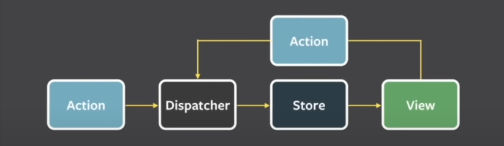

Que es redux? **_Imagina que tienes una aplicación grande con muchos componentes y datos que se están actualizando constantemente. En lugar de tener que pasar datos de un componente a otro, Redux almacena todos los datos importantes en un solo lugar llamado "store".

Cada vez que algo en la aplicación cambia, se envía una "acción" al store que describe qué ocurrió. Entonces, el store actualiza su estado interno en función de esa acción y notifica a los componentes interesados que algo ha cambiado.

En resumen, Redux te ayuda a mantener todo organizado y a asegurarte de que los componentes siempre tengan acceso a los datos actualizados de la aplicación. Es especialmente útil en aplicaciones grandes y complejas, donde el manejo del estado puede volverse confuso y difícil de mantener._**

Para entender redux vamos a tener que entender cada  uno de los concepto de la siguiente imagen:



Primero tenemos que entender que es un reducer? Un reducer es como tomar un valor de entrada y convertir un valor de salida donde el valor de entrada es el esatdo y una accion osea el stado puede ser 0 y la accion puede ser sumar entonces el valor de salida puede ser 1

Ejemplo del reducer mas inutil que existe:
```js
const reducer = (state, action) => state
//es un reducer que como parametro le llega un stado y una axion y te devuelbe el mismo estado
```


# Que son las acciones en redux

Una vez que vimos el reducer mas inutil lo podemos convertir en uno mas util de la sigiente manera:

```js
//Este es el reducer inutil
const reducer = (state, action) => state
```

para convertirlo a un reducer mas util tenemos que crear una accion como por ejemplo pasar de estado 0 y sumar 1:

```js
//este es el reducer
const counterReducer = (state, action) => {
	state
}

//y es la accion 
const actionIncremented = {
 type: '@counter/incremented'
}

counterReducer(0, actionIncremented)//aqui pasamos el stado y la accion
```

En este punto ya creamos la accion y el estado haora nos falta que el reducer aga algo osea que segun que accion pasemos va actuar de cierta manera

```js
const counterReducer = (state, action) => {
  const {type} = action
  //aqui recuperamos el tipo de accion
  if(type === '@counter/incremented'){return state + 1}
  //aqui le decimos si el tipo de accion es incrementar vamos a sumarle uno al estado
}

//y es la accion 
const actionIncremented = {
 type: '@counter/incremented'
}

counterReducer(0, actionIncremented)//aqui pasamos el stado y la accion
//output: 1
```

# Agregando mas acciones y refactorizando los if

Para aregar mas acciones tenemos que agregar mas objetos con types para ver esto vamos a agregar el decrement y vamos a convertir el if por un case 

```js
//================== reducer ======================================
const counterReducer = (state, action) => {
  const {type} = action
  switch(type){
	  case '@counter/incremented':
	   return state + 1
	   case '@counter/decrement':
	   return state - 1}
  }

//=================== acciones ==================================== 
const actionIncremented = {
 type: '@counter/incremented'
}

const actionDecrement = {
type: '@counter/decremented'
}

counterReducer(0, actionIncremented)
```

Pero esto nunca se utiliza de esta manera ya que si agreamos un iteracion mas del reducer nos regresa otro estado nuevo como solucionamos esto =>

# Contener el estado con store

En el ejemplo pasado nuestro reducer funcionaba pero el problema es que al momento de modificar el estado inicial con el reducer este lo convertia pero si loque queriamos volver a convertir se reseteaba el estado

Que es la store? **_En Redux, la "store" es el objeto que almacena el estado de la aplicación y proporciona una interfaz para acceder y actualizar ese estado. La store es esencialmente un contenedor que almacena todos los datos importantes de la aplicación en un solo lugar._**

Priemro tenemos que crear la store importando createStore from redux:
```js
import {createStore} from 'redux'
```

Una vez importado createStore le tenemos que indicar cual es el reducer que va usar osea cual es la funcion que va a modificar el estado

```js
const counterReducer = (state = 0, action) => {//definimos por default que el estado es 0
  const {type} = action
    switch(type){
	  case '@counter/incremented':
	   return state + 1
	   case '@counter/decrement':
	   return state - 1
    }
}

const actionDecrement = {
type: '@counter/decremented'
}

const actionIncremented = {
 type: '@counter/incremented'
}

const store = createStore(counterReducer)
//aqui indicamos que el reducer que vamos a usar es counterReducer

//=========================== 1 iteracion del reducer =========================
store.dispatch(actionIncremented)
//aqui indicamos que la accion que quremos hacer es increment
store.getState()//con esto recuperamos el valor del estado
//output: 1


//=========================== 2 iteracion del reducer =========================
store.dispatch(actionIncremented)
//aqui indicamos que la accion que quremos hacer es increment
store.getState()//con esto recuperamos el valor del estado
//output: 2
```

# Suscribirse a una store

En el ejemplo anterior nuestro estado ya se acomula y lo podemos usar con la store el problema es que cuando quremos ver el nuevo valor del estado tenemos que  hacer .getState esto lo podemos solucionar suscribiendonos a la store de la siguiente manera

```js
const counterReducer = (state = 0, action) => {//definimos por default que el estado es 0
  const {type} = action
    switch(type){
	  case '@counter/incremented':
	   return state + 1
	   case '@counter/decrement':
	   return state - 1
    }
}

const actionDecrement = {
type: '@counter/decremented'
}

const actionIncremented = {
 type: '@counter/incremented'
}

const store = createStore(counterReducer)

store.subscribe(() => {
console.log(store.getState())
}) 
//aqui lo que le estamos diciendo es cada vez que el estado de la store se actualize has un getState

//=========================== 1 iteracion del reducer =========================
store.dispatch(actionIncremented)
//=========================== 2 iteracion del reducer =========================
store.dispatch(actionIncremented)
//output:1
//output:2
```

Esto es muy util por que con esto podemos actualizar la UI cada que detectemos un cambio

# Agregando redux a react

```jsx
import React from 'react'
import ReactDOM from 'react-dom/client'
import { createStore } from 'redux'

const counterReducer = (state = 0, action) => {
  const { type } = action;
  switch (type) {
    case "@counter/incremented":
      return state + 1;
    case "@counter/decrement":
      return state - 1;
    case "@counter/reset":
      return state = 0
    default:
      return state;
  }
};  

const store = createStore(counterReducer); 
const actionIncremented = {
  type: "@counter/incremented"
};
const actionDecrement = {
  type: "@counter/decrement"
};
const actionReset = {
  type: "@counter/reset"
}

store.subscribe(() => {
  console.log(store.getState());
});

store.dispatch(actionReset);
store.dispatch(actionIncremented);
store.dispatch(actionIncremented);

ReactDOM.createRoot(document.getElementById('root')).render(
  <React.StrictMode>
    <div>
      {store.getState()}
    </div>
  </React.StrictMode>,
)
//en el ejmplo lo que hacemos es mostrar en pantalla el estado
```

En el ejemplo anterior pegamos el codigo de redux para mostrar en pantalla el estado

Pero lo que vamos a acer es remplasar los **dispatch** por un evento que al hacer click aumente el contador o lo reste
```jsx
ReactDOM.createRoot(document.getElementById('root')).render(
  <React.StrictMode>
    <div>
      {store.getState()}
    </div>
    <button onClick={() => {store.dispatch(actionIncremented)}}>
      +
    </button>
    <button onClick={() => {store.dispatch(actionDecrement)}}>
      -
    </button>
    <button onClick={() => {store.dispatch(actionReset)}}>
      reset
    </button>
  </React.StrictMode>,
)
```

El resultado de este ejemplo sera el siguiente


Pero te vas a dar cuenta que por mas que le des a los botones estos no cambian ya que no estamos actualizando la UI

# Suscribiendonos a la store para actualizar la UI

En el ejemplo anterior los botones no mostraban ni un cambio en la UI esto es porque no estamos actualizando la UI para hacer esto podemos suscribirnos a la store y renderizar el componente cada que cambie el estado de la siguiente manera

```jsx
const renderApp = () =>
{ReactDOM.createRoot(document.getElementById('root')).render(
  <React.StrictMode>
    <div>
      {store.getState()}
    </div>
    <button onClick={() => {store.dispatch(actionIncremented)}}>
      +
    </button>
    <button onClick={() => {store.dispatch(actionDecrement)}}>
      -
    </button>
    <button onClick={() => {store.dispatch(actionReset)}}>
      reset
    </button>
  </React.StrictMode>,
)}

renderApp()
//convertimos el renderizado en una funcion y lo ejecutamos 1 vez para renderizar
store.subscribe(
  renderApp
)//cada vez que el estado cambie vamos a renderizar de nuevo la aplicacion
```

<FONT color='red'>Nota: este es solo un ejmeplo esto es una muy mala practica ya que estamos renderizando toda la app multiples vezes</FONT>

# Haciendo aplicacion de notas con redux

Primero lo que tenemos que hacer es el reducer de las notas de la siguiente manera

```js
const noteReducer = (state = [], action) => {
  switch(action.type){
    case 'NEW_NOTE':
      //las acciones son objetos por lo que podemos pasar mas cosas no solo la accion
      return state.concat(action.payload)//lo que etsamos haciendo es mutando el estado con push
  }
}


```

luego creo un componente de para renderizar las notas que creamos

```jsx
store.dispatch({
  type: 'NEW_NOTE',
  payload: {
    content: 'hola adios',
    important: true
  }
})
//aqui creo la primera nota

const App = () => {
  const state = store.getState()
  
  return (
    <div>
      {state.map((element) => {
        return <li key={element.content}>{element.content}</li>
      })}
    </div>
  )
}
```

<FONT color='red'>Nota: lo mejor seria tener nuestros reducers en un archivo separado</FONT>

<FONT color='red'>Nota: NUNCA se debe de mutar un estado en redux puedes usar librerias para evitarlo</FONT>

# ActionCreators en redux

que son los ActionCreators en redux?**_En Redux, los action creators son funciones que crean y devuelven objetos de acción. Los objetos de acción son simplemente objetos que tienen una propiedad "type" que describe el tipo de acción que se está realizando, y opcionalmente otros datos que se necesitan para realizar la acción._**
osea es una forma de reutilizar la forma en la que hacemos las acciones 

Ejemplo: 
```js
  const createNote = content => {
    return {
      type: 'NEW_NOTE',
      payload:{
        content,
        important: true
      }
    }
  }//loque hacemos e suna funcion que nos va a regresar una accion

  store.dispatch(createNote(content))//aqui usamos la funcion
  ```

# Conectar Redux con React usando react-redux

En los ejemplos que emos visto ya usamos redux pero es un redux que esta separado de react es independiente de react pero como podemos separarlo?

imagina que tienes un estado de notas y quieres hacer un form que te permita gregar una nota en un componente separado puedes pensar que la forma mas facil de hacer esto es ir arrastrando la store por componentes

<FONT color = 'red'>Nota: podemos decidir si nuestra store va a hacer global o no pero esto es una muy mala practica </FONT>
# Hacer un estado global con provider de react-redux

Entonces lo que quiero hacer es tener una store que podamos usar en toda la aplicacion una forma de hacer esto es usando* provider * que lo que hace es proporcionar una store para toda la aplicacion 

Ejemplo: 

```jsx

const store = createStore(noteReducer)

ReactDOM.createRoot(document.getElementById('root')).render(
  <Provider store={store}>
    <App store={store}/>
  </Provider>,
)
//esto significa que la store esta disponible en toda nuestra aplicacion
```

# Como acceder a la store desde otro componente

ya tenemos creado nuestro estado global pero como accedo a el? LA forma de hacerlo es usando hooks como react tiene sus hooks redux react tambien tiene hooks la una forma es accediendo a toda la estore de la siguiente manera

```jsx
import { useStore } from 'react-redux'

const store = useStore()

return(<h1>{store.getState()}</h1>)
```
Esto es una manera pero no es nada recomendable ya que si hacemos esto estamos pidiendo toda la store de la app y nosotros solo queremos uana entonces esto solo es util si queremos todo el estado de la app

la segunda froma es usnado un hook llamado useSelector
```jsx
import { useSelector } from 'react-redux'

 const state = useSelector(state => state)
 //aqui le estamos diciendo  el estado que queremos es el estado completo pero cuando nuestra app escale podemos ir accediendo a los diferentes estados por ejemplo state.notes
```

<FONT color='red'>Nota: al momento de usar useSelector hacemos la subscripcion automatica pero al momento de usar useEstore no se hace la subscripcion</FONT>
# Despachando estados desde otro componente

Una vez que ya tengo el estado en el componente como hago para despachar la store pues una forma es usando el hook llamado *useDispatch* que lo que hace es darnos directa mente la funcion de despachar 

Ejemplo 
```js
import { useDispatch, useSelector } from 'react-redux'

const dispatch = useDispatch()
dispatch({type: 'ADD_NOTE'})
//Como vex ya no tenemos que usar la store ya que nos da directamente el dispatch
```

# Combinar reducers con combineReducer

imaina que tienes un reducer que te permite manejar notas osea agregar o editarlas pero quiero un reducers que me sume numeros como esto es dos temas que no tienen nada que ver quiero que sean reducers por separado esto lo podemos hacer con **combineReducers**

```js
const reducers = combineReducers({
  notes: noteReducers,
  suma: sumaReducers
})
//lo que estamos diciendo es que queremos que de las notas se encarge el noteReducer y de las sumas el otro
const store = createStore(reducers)
//luego creamos la store con los reducers combinados
```

<FONT color='red'>Nota: es muy importante que los nombres de las acciones sean unicos ya que le llega a los dos reducers</FONT>

<FONT color='red'>Nota: en este punto donde ya combinamos reducers es donde tiene sentido usar useSelector embes de useStore ya que tenemos un objeto con los nombres de los reduceres</FONT>

# Redux-devtools

Si quieres activar las redux-devtools de la extension aqui hay un tutorial [DevTools](https://www.youtube.com/watch?v=1Bg-D76b24o&list=PLV8x_i1fqBw0Kn_fBIZTa3wS_VZAqddX7&index=28)
Y aqui tienes la extencion de google  [Redux DevTools - Chrome Web Store (google.com)](https://chrome.google.com/webstore/detail/redux-devtools/lmhkpmbekcpmknklioeibfkpmmfibljd?hl=es)

# Middlewares en redux

Que es un middleware en redux? **_En Redux, los middlewares son una forma de extender las capacidades del flujo de datos y la gestión de acciones. Son funciones que se insertan entre la acción que se dispara y el momento en que alcanza el reducer correspondiente._**
en pocas palabras es una funcion que interseptan la accion 

El siuiente ejemplo lo unico que hace es regresar que accion estas usando y el estado antes de hacer la accion el next indica que siga con su camino

```js
 const loggerMiddleware = (store) => (next) => (action) => {
  console.log('Action:', action.type);//aqui recuperamos la accion
  const result = next(action);
  console.log('State:', store.getState());//aqui recuperamos el satdo
  return result;//aqui le decimos que siga con su camino
};
```


# middleware para trabarjar con acction creators asincronos redux thunk

Que hace redux thunk? **Redux Thunk es un middleware popular para Redux que permite manejar acciones asíncronas de manera más sencilla.
En Redux, las acciones normalmente son objetos simples que describen un cambio en el estado de la aplicación. Estas acciones son despachadas y enviadas al reducer correspondiente, que actualiza el estado en función de la acción.
Sin embargo, en ocasiones necesitamos realizar acciones asíncronas, como hacer una solicitud HTTP o esperar un tiempo antes de despachar una acción. Aquí es donde Redux Thunk entra en juego.
Redux Thunk permite que una acción no sea solo un objeto, sino también una función. Esta función puede contener lógica asíncrona y, en lugar de despachar una acción de inmediato, puede despachar una o más acciones después de que se complete la lógica asíncrona._**

Para empezar a trabajar con redux thunk tenemos que instalar redux-thunk luego tenemos que indicarle a la store que queremos usar ese middleware de la siguiente manera
```js
export const store = createStore(
    reducers,
    composeWithDevTools(
       applyMiddleware(thunk)//si no tenemos las dev-tools de redux no tenemos que poner composeWithDevoTools()
    )
)
```

Una vez echo esto ya podemos empezar a hacer actions creators que regresen funciones la ventaja es que podemos hacer que regrese funciones acincronas ejemplo: 

```js
 export const initNotes = () => {
  return async (dispatch) => {//le tenemos que pasar dispatch como parametro para indicar cuando hacerlo
    const notes = await getAll()//hacemos la funcion asincrona
    dispatch({
      type: 'INIT_NOTES',
      payload: notes
    })
  }
//lo que le estamos diciendo es espera a que notas se resuelva y una vez resuelta despacha lo siguiente
  

 }
```

<FONT color='red'>Nota: es muy importante que no cimbinemos los actions creators con los services</FONT>

