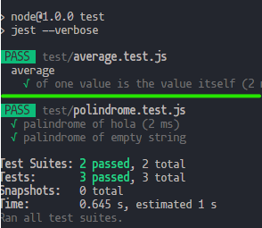
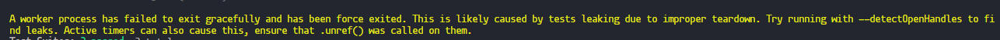

# Testing
#TESTING 

Que es el testing? _"El testing es una herramienta de feedback que permite detectar errores en el proceso de desarrollo para poder solucionarlos a tiempo. <mark style="background: #D2B3FFA6;">Se puede describir como el proceso de verificación y validación de una aplicación</mark> 1. Es una disciplina en la ingeniería de software que permite tener procesos, métodos de trabajo y herramientas para identificar defectos en el software alcanzando un proceso de estabilidad del mismo "._-CHAT bing 
en pocas palabras puedes detectar errores en el codigo emular que pasaria si tal dato no llegara

por ejemplo tenemos el siguiete codigo 
```javascript
    const suma = (a, b) => {
        return a - b
    }
```

este copdigo esta mal porque no regresa lo que esperamos entonces lo que hariamos en un entorno de Testing seria 

```javascript
if (suma(1, 3) !== 4) {
  console.log('suma of 1 and 3 expected to be 4')
}
```

y haci probando diferentes casos este es un caso muy basico para entender la forma de hacer testing basico

pero este codigo todabia se puede mejorar usando 

### console.assert()

console.assert nos debuelve el error que pongamos si la sentencia es falsa 


 ```javascript
    const suma = (a, b) => {
        return a - b
    }

    console.assert(
  suma(1, 3) === 4, 'error'
)
```

este codigo lo podriamos factorizar de la siguiente manera
```javascript
const suma = (a, b) => {
  return a - b
}

const checks = [
  { a: 1, b: 1, result: 2 },
  { a: 1, b: 2, result: 3 },
  { a: 2, b: 2, result: 4 }

]

checks.forEach((element) => {
  const { a, b, result } = element
  console.assert(suma(a, b) === result, `${a} mas ${b} deberia dar ${result}`)
})
```
<FONT color="red">Nota: esto solo es un ejemplo para entender a grandes rangos lo que es el testing esto nunca se deberia de usar para aplicaciones reales </FONT>

## Usando JEST para hacer testing

Que es jest? jest es un pakete que nos ayudara ha acer test esta echo por facebook pero estaba pensado mas para el frontend que para el backend pero con el tiempo esto se ha ido generalisando para el backend haciendo que funcione igual para las dos partes

como usar jest? para usar jest solo tenemos que instalarlo como *dependencia de desarollo* con npm

otra cosa que teenmos que saber para empezar a usar jest es que en el package.json teenemos que especificar en que entorno queremos ejecutar jest por ejemplo en node seria de la siguiente manera 

```javascript
  "jest": {
    "testEnvironment": "node"
  }
}
```

## crendo el primer test con JEST

1. primero tenemos que crear un archivo que tenga la extension **.test.js** ya que JEST solo detecta estos archivos

2. iniciamos el test con la funcion **test()** y ponemos en el primer parametro lo que hace el test

```javascript
    //queremos verificar esta funcion
    const palindrome = (string) => {
        return string.split("").reverse().join("")
    }
    //===================================
    //queremos ver si funciona con la palabra hola
    test('verificar el palindrome de hola', () => {
    })
    
```

3. una vez inicido el test tenemos que recuperar en una variable el resultado de la funcion testiada y pasar lo que esperamos que regrese esa funcion

```javascript
    const palindrome = (string) => {
        return string.split("").reverse().join("")
    }
    //===================================
    //queremos ver si funciona con la palabra hola
    test('verificar el palindrome de hola', () => {
        const result = palindrome('hola')//recuperamos la respuesta de la funcion

        expect(result).toBe('aloh')//pasamos la expectativa y luego la verdadera que deve estar checkada por nosotros
    })
``` 

<FONT color="red">Nota: si usamos eslint veras que se esta quejando esto es porque no se requiere que importemos jest pero podemos solucionarlo aggregando lo siguiente en package.json ```"eslintConfig":{"env":{"jest":true}```</FONT>

## Ejecutar test con jest

para ejecutar los test de jest podemos usar la terminal pero esto seria muy tardado entonses lo mejor seria agregar un script en el package.json que se llame test de la siguieente manera

```json
  "scripts": {
    "dev": "nodemon index.js",
    "start": "node index.js",
    "lint": "eslint .",
    "test": "jest --verbose"//este es el de test
  },//este seria los scripts vasicos para una aplicaicon
```

## haciendo mas casos 

que pasaria si a una funcion que requiere un string le pasamos un string vasio pues es una buena pregunta para jest


```javascript
test('palindrome of empty string', () => {
  const result = palindrome('')

  expect(result).toBe('')
})
```

<FONT color="red">Nota: como el metodo toBe existen muchos no te los tienes que aprender afuersa pero si quieres saber mas puedes chekar la documentacion de [jest doc](https://jestjs.io/docs/expect)</FONT>

## usando describe en JEST para mejorar los test

antes teniamos que indicar que asia cada test porejemplo ```palindrome of empty string``` pero para no tener que estar repitiendo la funcion que en ese caso seria palindrome podemos usar **descrive**

esto en que cambia en el codigo podrias decir que nada pero en el output lo hace mas legible ya que se muestra de la siguiente manera



## Haciendo testing a una api
#api
 
Si quieres encontrar la api que vamos a usar o quieres hacerla [[NodeJS#Creando api res]]

Primero tenemos que hacer una nueva base de datos para testing 

### Hacer conexion a la nueva vase de datos

lo que podriamos hacer es una nuevo archivo de conexion a mongo pero esto estaria mal ya que no es nesesario hacer otro lo que podemos usar es variables de entorno

1. tenemos que definir las variables de entorno depende de donde corramos el npm por ejemplo si lo hacemos en el entorno de desarollo tendriamos que definir <mark style="background: #FFB8EBA6;"> NODE_ENV=development</mark> ejemplo 

```json
 "scripts": {
    "dev": "cross-env NODE_ENV=development nodemon index.js",
    "start": "cross-env NODE_ENV=production node index.js",
    "lint": "eslint .",
    "test": "cross-env NODE_ENV=test jest --verbose"
  },
```

2. luego en nuestro arichivo de conexion a mongo tenemos que usar usar la variable de entrono para saber en que entorno estamos corriendo la base de datos ejemplo:

```JAVASCRIPT
//aqui recuperamos las bariantes de entorno que son los conection string y el entorno
const { MONGO_DB_CONECTIONSTRING, MONGO_DB_CONECTIONSTRING_TEST, NODE_ENV } =process.env
  
//decimos si NODE_ENV es test conecta la base de datos con el conexionString de test
const connectionString = NODE_ENV === 'test' ? MONGO_DB_CONECTIONSTRING_TEST : MONGO_DB_CONECTIONSTRING
```

<FONT color="red">Nota: el cross-env es una libreria para windows ya que en windows podriamos llegar a tener errores al momento de usar los entornos</FONT>

<FONT color="red">Nota: crear una nueva base de datos para testing es una mala practica mas adelante cambiaremos de metodo </FONT>

## Testiando end points 

una vez conectada nuestra base de datos tenemos que pensar que deberiamos de testear en este caso lo que vamos a testear son los end points o las rutas a donde accede el usario

## usando super test para testear api

Que es supertest? _"Supertest es un módulo de Node.js que proporciona una interfaz Fluent API para probar servicios HTTP. Utiliza superagent como cliente HTTP y ofrece aserciones a través de su Fluent API. ¿Quieres saber más sobre Supertest o cómo usarlo?"_-bing chat
En pocas plabaras super test <mark style="background: #FFB8EBA6;">nos va a ayudar a testear los end points de nuestra api</mark>

1. Primero lo que tenemos que hacer es <mark style="background: #FFF3A3A6;">instalar la dependencia como dependencia de desarollo</mark>

2. Crear un fichero de test con la extencion <mark style="background: #FFF3A3A6;">.test.js e importar super test como dependencia y la app e iniciar supertest con la app</mark> de la siguiente manera 
```javascript
const supertest = require('supertest')
const app = require('../app.js')

const api = supertest(app)
// asegurate que la app se este exportando desde el archivo raiz 
```

3. <mark style="background: #FFF3A3A6;">Hacer nuestro primer test</mark> de la siguiente manera en el ejemplo vamos a verificar si las notas se devuelven en json

```javascript
const api = supertest(app)

test('notes are returned as json', () => {
  api
    .get('/api/notes')
    .expect(200)
    .expect('Content-Type', /application\/json/)
})
```
 pero esto esta <mark style="background: #FF5582A6;">mal ya que el test es asyncrono por lo que tendriamos que esperar entonces este test siempre se pasara </mark>ya que no estamos esperando y se esta saltando las pruebas

4. solucionar problemas de espera <mark style="background: #FFF3A3A6;">haciendo la funcion asyncrona</mark>
 ```javascript
const api = supertest(app)

test('notes are returned as json', async () => {
  await api
    .get('/api/notes')//este es la ruta que estamos testiando
    .expect(200)//el status que esperamos
    .expect('Content-Type', /application\/json/)//y el tipo de archivo que queremos recivir 
})
```

<FONT color="red">Nota: simepre tenemos que forzar un error nosotros mismos para saber si nuestro test esta funcionando o si se esta saltando los test</FONT>

Que es /application\/json/? este es un regex o exprecion regular que lo que hace es verificar si lo que regresa en un json 
_"[Una expresión regular (también conocida como regex o regexp) es una secuencia de caracteres que conforma un patrón de búsqueda](https://es.wikipedia.org/wiki/Expresi%C3%B3n_regular)[1] (https://es.wikipedia.org/wiki/Expresi%C3%B3n_regular). [Se utilizan para buscar coincidencias en el texto de entrada y pueden incluir literales de carácter, operadores o estructuras](https://learn.microsoft.com/es-es/dotnet/standard/base-types/regular-expression-language-quick-reference)"_

<FONT color="red">Nota: si ves cuando haces un test lo que regresa son cada uno de los console.log() que tenemos en nuestro codigo esto lo podemos arrglar agregando en el package.json lo siguiente ``` "test": "cross-env NODE_ENV=test jest --verbose --silent"```</FONT> 


## solucinando posibles errores de la api

- tambien hay probalididades que nos regrese lo siguiente

esto significa que no emos serrado algo ya sea una conexion con la base de datos o una conexion con el servidor <mark style="background: #FFB8EBA6;">podemos ejecutar --detectOpenHandles para detectar la conexion avierta</mark> 

###  Solucionando conexion abierta con el Hook afterAll()
En este caso el puerto que estab abierto era el escuhca del servidor pero para solucionar esto podemos hacer lo siguiente <mark style="background: #FF5582A6;">tenemos que exportar no solo la app si no que tambien el servior</mark>
```javascript
//esto es miy importante importar el app y el server
const { app, server } = require('../index')
const mongoose = require('mongoose')

test('notes are returned as json', async () => {
  await api
    .get('/api/notes')
    .expect(200)
    .expect('Content-Type', /application\/json/)
})

afterAll(()=> {
	server.close()
	mongoose.connection.close()
})//lo que decimos es cuando termine todos los test cierra la conexion del server y la de la base de datos

```