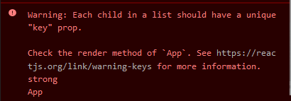

# React
#React

react es una biblioteca de javascript
desarollado por meta y de codigo abierto

## Crear un proyecto con react

ay muchas formas de crear un proyecto con react pero una de las mas comunes es con el comando `npx create-react-app`
el cual nos levantara un proyecto de react al instante

## Componentes

un componente es algo que luego se va a renderizar en el DOM

en este caso el componente seria App y se esta renderizando en root


dentor de un componentes puede ver variavles y funciones

react no puede renderizar objetos pero puedes renderizar un monton mas de cosas como listas, strings y numeros ...

<FONT color=red>Nota: los componentes se deben declarar siempre en mayuscula ya que de otra forma el navagador no tomara en cuenta estos componentes</FONT>

## Props

los props son paresidos a un parametro de una funcion de js pero con la diferencia de que estos son de react

los props de reatc se pasan como si fuera un atributo HTML por ejemplo

```jsx
const Mensaje = (props) => {
  return <h1>{props.msj}</h1>;
};

function App() {
  return (
    <div className="App">
      <Mensaje msj="hola" />
    </div>
  );
}
```

en este caso el param seria msj lo que hace react por detras es **combertir cada uno de estas propiedades en un objeto** entonces para acceder a cada uno de estos seria como acceder a una propiedad de un objeto en este caso seria: `props.msj`

## como volver a renderizar un componente

para que queremos volver a renderizar un componente? pues la respuesta es para darle dinamismo a nuestros componentes y que no sean siempre estaticos

### que es el estado en react?

El estado en React nos ayuda a crear datos mutables o datos que pueden ser modificados. Para manejar el estado depende de si nuestro componente es generado con una clase o si es un componente funcional.

una forma de entender el estado en react seria como un switch cuando sabes que esta prendido o apagado
si el switch esta prendido **el estado del switch es on** y este estado se refleja con la luz si esta esta en on la luz esta prendida pues lo mismo con react el **estado se refleja en el UI**

## useState()

el useState es una forma de dar dinamismo a los componentes pero como funciona **lo que hace useState es regresar un array de dos pociciones donde la primera pocicion es el valor del estado y la segunda nos debuelve un metodo para actualizar el estado**

primera pocicion del array esta lo que queremos renderizar

segunda pocicion del array tenemos que mandar su nuevo valor

```javascript
const App = () => {
  const contador = useState(0);

  const contadorValue = contador[0]; //este es el valor del estado
  const updateContador = contador[1]; //este es el valor que vamos a actualizar

  setInterval(() => {
    updateContador(contadorValue + 1); //este es el metodo que vamos a usar osea lo que estamos diciendo es:
    //cada 1000 milisegundos vas a actualizar el estado actual sumandole 1
  }, 1000);

  return (
    <div>
      <h1>{contadorValue}</h1>
    </div>
  );
};
```

tambien podemos realizar esto con desestructuracion aorrandonos las dos linias donde sacamos en una variable los dos elementos del arr

```javascript
const App = () => {
  const [contadorValue, updateContador] = useState(0); //aqui esta la desestructuracion

  setInterval(() => {
    updateContador(contadorValue + 1);
  }, 1000);

  return (
    <div>
      <h1>{contadorValue}</h1>
    </div>
  );
};
```

ejemplo con bottom:

```javascript
const App = () => {
  const [contadorValue, updateContador] = useState(0);

  return (
    <div>
      <button
        onClick={() => {
          updateContador(contadorValue + 1);
        }}
      >
        incrementar
      </button>
      <h1>{contadorValue}</h1>
    </div>
  );
};
```

updatecontador o al segundo elemento del array tambien le podemos pasar una funcion que al ejecutarse cambie el valor ejemplo:

```javascript
const App = () => {
  const [contadorValue, updateContador] = useState(0);

  return (
    <div>
      <button
        onClick={() => {
          updateContador((contadorValue) => {
            return contadorValue + 2;
          });
        }}
      >
        incrementar
      </button>
      <h1>{contadorValue}</h1>
    </div>
  );
};
```

<FONT color="red">Nota: nunca se debe de utilizar un setInterval dentro de un componente este solo es un ejemplo</FONT>

si quieres entender mas aqui esta el url a [React Docs](https://reactjs.org/docs/hooks-intro.html)

## funciones helper

piensa que un componente dentro de su cuerpo(body) puede almacenar funciones lo que nos permite hacer funciones helper

<FONT color="red">Nota en un onclick o en casi todos los eventos NO ay que pasar la ejecucion de una funcion sino que tenemos que pasar la funcion</FONT>

## renderizado condicional

que es un renderizado condicional?un renderizado condicional es un renderizado que solo se lleva acabo si una condicion es sierta de lo contrario pasaria otra cosa

```javascript
const App = () => {
  const [contadorValue, updateContador] = useState(0);

  const handleClick = () => {
    updateContador(contadorValue + 1);
  };

  const reset = () => {
    updateContador(0);
  };

  const filtro = contadorValue % 2 === 0; //aqui evaluamos si es par o impar

  return (
    <div>
      <button onClick={handleClick}>incrementar</button>
      <button onClick={reset}>resetiar</button>
      <p>{filtro ? "es par" : "es impar"}</p>
      {/*aqui vemos por medio de una ternaria si es verdad en el caso de que
          sea verdad vas a renderizar Es par si esto es falso renderizas Es
          impar*/}
      <h1>{contadorValue}</h1>
    </div>
  );
};
```

## Ejemplos con un solo estado(objetos en estados)

podemos juntar dos estados en uno aunque no es una buena practica ya que el codigo pierde legibilidad

- ejemplo con dos estados:

```javascript
const App = () => {
  const [left, setLeft] = useState(0);
  const [right, setRight] = useState(0);

  return (
    <div
      style={{
        display: "flex",
        justifyContent: "center",
        alignItems: "center",
        height: "100vh",
      }}
    >
      {left}
      <button
        onClick={() => {
          setLeft(left + 1);
        }}
      >
        left
      </button>
      <button
        onClick={() => {
          setRight(right + 1);
        }}
      >
        right
      </button>
      {right}
    </div>
  );
};
```

este componente lo que hace es darnos dos botones uno para actualizar el estado de la derecha y otro de la izquierda aora vamos a aprender hacerlo con solo un estado

- ejemplos con un solo estado:

```javascript
const App = () => {
  const [counters, setCounters] = useState({ left: 0, right: 0 }); //aqui definimos el estado de left como 0 y el de right como0

  const sumaLeft = () => {
    setCounters({
      left: counters.left + 1,
      right: counters.right,
    });
  }; //aqui lo que estamos haciendo es decir que sume uno a left pero a right lo deje como esta

  const sumaRight = () => {
    setCounters({
      left: counters.left,
      right: counters.right + 1,
    });
  }; //aqui lo que estamos haciendo es decir que sume uno a right pero a left lo deje como esta

  return (
    <div
      style={{
        display: "flex",
        justifyContent: "center",
        alignItems: "center",
        height: "100vh",
      }}
    >
      {counters.left}
      <button onClick={sumaLeft}>left</button>
      {/* aqui imvocamos a las funcion */}

      <button onClick={sumaRight}>right</button>
      {/* aqui imvocamos a las funcion */}

      {counters.right}
    </div>
  );
};
```

### pero si esto es una mala practica para que nos serviria

pues la respuesta es para manejar objetos en un estado por si queremos manejar mas de dos contadores

como en el ejemplo que se nos muesta acontinuacion donde tenemos dos counters con dos botones uno incrementa el derecho y otro el izquierdo pero queremos tener uno que diga el total de clicks

```javascript
const App = () => {
  const [counters, setCounters] = useState({
    left: 0,
    right: 0,
    totalClicks: 0, //aqui definimos un tercer contador
  });

  const sumaLeft = () => {
    setCounters({
      left: counters.left + 1,
      totalClicks: counters.totalClicks + 1, //aqui lo que hacemos es sumar uno al total de clicks
      right: counters.right,
    });
  };

  const sumaRight = () => {
    setCounters({
      left: counters.left,
      right: counters.right + 1,
      totalClicks: counters.totalClicks + 1, //aqui lo que hacemos es sumar uno al total de clicks
    });
  };

  return (
    <div
      style={{
        display: "flex",
        justifyContent: "center",
        alignItems: "center",
        height: "100vh",
      }}
    >
      {counters.left}
      <button onClick={sumaLeft}>left</button>

      <h1>{counters.totalClicks}</h1>
      <button onClick={sumaRight}>right</button>
      {counters.right}
    </div>
  );
};
```

pero imagina que tenemos un objeto muy grande en un estado y queremos cambiar uno de los elementos de este objeto tenemos que actualizar de nuevo todos los elementos de el objeto como se ve a continuazion

```javascript
const [counters, setCounters] = useState({
  left: 0,
  right: 0,
  numeroMantener: 100,
});

const sumaLeft = () => {
  setCounters({
    left: counters.left + 1,
    right: counters.right,
    numeroMantener: counter.numeroMantener,
    //solo quiero cambar uno y tengo que escribir los tres
  });
};

const sumaRight = () => {
  setCounters({
    left: counters.left,
    right: counters.right + 1,
    numeroMantener: counter.numeroMantener,
    //solo quiero cambar uno y tengo que escribir los tres
  });
};
```

pues esto tiene una solucion que se hace con el spread operator (...) entonces lo que hariamos con el operador es clonar el objeto y sobrescrivir solo los que tenemos que escribir

```javascript
const [counters, setCounters] = useState({
  left: 0,
  right: 0,
  numeroMantener: 100,
});

const sumaLeft = () => {
  setCounters({
    ...counters//aqui solo clonamos el obj haciendo que solo sobrescriba el valor que queremos cambiar
    left: counters.left + 1,
    //solo quiero cambar uno y tengo que escribir los tres
  });
};

const sumaRight = () => {
  setCounters({
    ...counters//aqui solo clonamos el obj haciendo que solo sobrescriba el valor que queremos cambiar
    right: counters.right + 1,
    //solo quiero cambar uno y tengo que escribir los tres
  });
};
```

## Arrays en estados

para usar los arrays en un estado tenemos que declarar en useState que vamos a uasr un array de la sig manera useState(**[]**) a difernencia de los objetos aqui tenemos que si o si **regresar un nuevo array** de la sigiente manera:

```javascript
const [Arr, setArr] = useState([]);

const addNumberInArr = () => {
  setArr((prevArr) => {
    return [...prevArr, Math.random()];
  });
};
```

lo que hacemos en el ejemplo es una funcion que al ejecutarse agrege un numero random al arr recuerda que el spray operator debuelbe un nuevo arr asi que este es el arr que regresa para actualizar el estado

<FONT color="red">Nota: evita tener estados que no nececitas usa los justos y necesarios</FONT>

## renderizar lista de elementos

para que queremos saber esto? pues la respuesta es facil ya que en react **los objetos no pueden ser hijos de una etqueta**.
entonses la solucion a este problema es usar javaScript nativo haciendo un map del objeto y regresando las propiedades como se ve acontinuacion

```javascript
const notes = [
  {
    id: 22,
    title: "hola mundo",
    date: "21/02/22",
    describe: "un articulo aburrido",
  },
  {
    id: 13,
    title: "medio mundo",
    date: "90/02/22",
    describe: "un articulo interesante",
  },
  {
    id: 17,
    title: "adios mundo",
    date: "11/02/22",
    describe: "cun articulo medio aburrido",
  },
];
export default function App() {
  return (
    <div className="App">
      {notes.map((note) => {
        return <p>{note.title}</p>;
      })}
      /* aqui mapiamos el objeto para regresar un arr */
    </div>
  );
}
```

### key en react

cuando renderizamos una lisat en react siempre nos va a dar un error de que no tiene key por lo que debemos de poner una etiqueta llamada key



```javascript
import "./styles.css";

const notes = [
  {
    id: 22,
    title: "hola mundo",
    date: "21/02/22",
    describe: "un articulo aburrido",
  },
  {
    id: 13,
    title: "medio mundo",
    date: "90/02/22",
    describe: "un articulo interesante",
  },
  {
    id: 17,
    title: "adios mundo",
    date: "11/02/22",
    describe: "cun articulo medio aburrido",
  },
];
export default function App() {
  return (
    <div className="App">
      {notes.map((note) => {
        return (
          <strong key={note.id}>
            <p>{note.title}</p>
          </strong>
        ); //aqui definimos el key con el id de cada nota
      })}
    </div>
  );
}
```

<FONT color="red">Nota: la key debe de estar en el lugar donde estamos iterando los datos</FONT>

[**CodeSandBox to examples**](https://codesandbox.io/s/musing-waterfall-2fvcqm?file=/src/App.js)

## Formularios en react

para trabajar con formularios en react una forma muy facil de hacerlo es con los estados ya que es la forma mas facil pero no siempre es la forma mas optima

```javascript
export default function App({ notesObj }) {
  const [note, setNote] = useState(notesObj); //este estado es para almacenar el objeto inicial
  const [newNote, setNewNote] = useState(""); //este estado es para recolectar el imput

  const handleChange = (e) => {
    setNewNote(e.target.value); //aqui recolectamos el imput(lo que se escribe)
  };

  const handleClick = () => {
    const noteToAddToState = {
      id: note.length + 1,
      title: newNote, //aqui le pasamos el newNote que biene del estado donde recolectamos el input
      date: new Date().toISOString(), //agregamos una fecha
      important: Math.random() < 0.5,
    }; //esta es la estructura de una nota
    setNote(note.concat(noteToAddToState));
  };

  return (
    <div>
      <h1>Notas</h1>
      {note.map((note) => (
        <Note {...note} key={note.id} />
      ))}
      <div>
        <input type="text" onChange={handleChange} value={newNote} />
        {/* este es el imput donde escribimos la nota */}
        <button onClick={handleClick}>
          {/* este es el boton con el que agregamos la nota */}
          crear nota
        </button>
      </div>
    </div>
  );
}
```

**pero una forma mucho mas correcta de hacer lo pasado es la siguiente y pon atencion de la etiquta form para abajo**

```javascript
export default function App({ notesObj }) {
  const [note, setNote] = useState(notesObj); //este estado es para almacenar el objeto inicial
  const [newNote, setNewNote] = useState(""); //este estado es para recolectar el imput

  const handleChange = (e) => {
    setNewNote(e.target.value); //aqui recolectamos el imput(lo que se escribe)
  };

  const handleSubmit = (e) => {
    e.preventDefault();
    const noteToAddToState = {
      id: note.length + 1,
      title: newNote, //aqui le pasamos el newNote que biene del estado donde recolectamos el input
      date: new Date().toISOString(), //agregamos una fecha
      important: Math.random() < 0.5,
    }; //esta es la estructura de una nota
    setNote(note.concat(noteToAddToState));
  };

  return (
    <div>
      <h1>Notas</h1>
      {note.map((note) => (
        <Note {...note} key={note.id} />
      ))}
      <form onSubmit={handleSubmit}>
        <input type="text" onChange={handleChange} value={newNote} />
        {/* este es el imput donde escribimos la nota */}
        <button>
          {/* este es el boton con el que agregamos la nota */}
          crear nota
        </button>
        {/* siempre el ultimo botton de un formulario sirbe como submit */}
      </form>
    </div>
  );
}
```

<FONT color="red">Nota: es muy importante que todos los input y los botones que envian el input esten dentro de la etiquta (</form/>)</FONT>

[**fullProyect**](https://codesandbox.io/s/musing-waterfall-2fvcqm?file=/src/App.js:85-1024)

## API`s en React

tu pordrias pensar que solo vasta con hacer un fetch y si en efecto tenemos que usar un fetch el problema es donde tenemos que pues no lo podemos usar dentro de un componente asi nomas porque estariamos haciendo un render infinito porque cada vez que se inicia el componente se va a hacer el fetch y cada vez que el fetch se hace ban a cambiar las propiedades y se va a renderizar de nuevo haci en bucle la respuesta es...

## useEffect()

useEffect es un hook que se ejecuta cada que se renderiza un componente pero este puede ser controlado perfectamente

```javascript
useEfect(
  {
    //funcion que se ejecutara cada que queramos
  } /*dependecias*/
);
```

<FONT color="red">Nota: si useEffct no se controla este se volvera a ejecutar cada que el componente se renderiza</FONT>

- como controlo useEffect?:para decidir cada cuando se ejecuta el useEffect tenemos que indicar una dependencia la cual dira cunado ejecutarse

- que es una dependencia?: una dependencia es una _"Las dependencias son variables o valores que están presentes en el useEffect y que se monitorean por React. Cada vez que se actualiza el componente, React compara las dependencias previas con las nuevas y si alguna ha cambiado, el efecto secundario se vuelve a ejecutar._"-chatGPT.
  **Entonces en pocas palabras una dependencia es una variable o un valor que cuando cambia tenemos que ejecutar useEffect** se pasa en forma de array por ejemplo: [variable1, variable2] si el valor de la variable1 o de la variable2 cambia el useEffect se volvera a ejecutar

```javascript
useEffect(() => {
  console.log("use effect");
  fetch("https://jsonplaceholder.typicode.com/posts")
    .then((data) => data.json())
    .then((data) => console.log(data));
}, []); //esto se estaria ejecutando solo una ves ya que no hay dependencias
```

<FONT color="red">Nota: si en un useEffect haces una peticion a una api react no esperara esta respuesta sino que renderizara lo que pueda como cosas externas a la api lo que hara react sera lo sigiente

> 1- renderizar <br/>
> 2- ejecutar useEffect <br/>
> 3- esperar la respuesta <br/>
> 4- volver a renderizar pero con la respuesta de la API </FONT>
