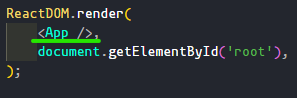

# React

react es una biblioteca de javascript
desarollado por meta y de codigo abierto

## Crear un proyecto con react

ay muchas formas de crear un proyecto con react pero una de las mas comunes es con el comando `npx create-react-app`
el cual nos levantara un proyecto de react al instante

## Componentes

un componente es algo que luego se va a renderizar en el DOM

en este caso el componente seria App y se esta renderizando en root



dentor de un componentes puede ver variavles y funciones

react no puede renderizar objetos pero puedes renderizar un monton mas de cosas como listas, strings y numeros ...

<FONT color=red>Nota: los componentes se deben declarar siempre en mayuscula ya que de otra forma el navagador no tomara en cuenta estos componentes</FONT>

## Props

los props son paresidos a un parametro de una funcion de js pero con la diferencia de que estos son de react

los props de reatc se pasan como si fuera un atributo HTML por ejemplo

```jsx
const Mensaje = (props) => {
  return <h1>{props.msj}</h1>;
};

function App() {
  return (
    <div className="App">
      <Mensaje msj="hola" />
    </div>
  );
}
```

en este caso el param seria msj lo que hace react por detras es **combertir cada uno de estas propiedades en un objeto** entonces para acceder a cada uno de estos seria como acceder a una propiedad de un objeto en este caso seria: `props.msj`

## como volver a renderizar un componente

para que queremos volver a renderizar un componente? pues la respuesta es para darle dinamismo a nuestros componentes y que no sean siempre estaticos

### que es el estado en react?

El estado en React nos ayuda a crear datos mutables o datos que pueden ser modificados. Para manejar el estado depende de si nuestro componente es generado con una clase o si es un componente funcional.

una forma de entender el estado en react seria como un switch cuando sabes que esta prendido o apagado
si el switch esta prendido **el estado del switch es on** y este estado se refleja con la luz si esta esta en on la luz esta prendida pues lo mismo con react el **estado se refleja en el UI**

## useState

el useState es una forma de dar dinamismo a los componentes pero como funciona **lo que hace useState es regresar un array de dos pociciones donde la primera pocicion es el valor del estado y la segunda nos debuelve un metodo para actualizar el estado**

primera pocicion del array esta lo que queremos renderizar

segunda pocicion del array tenemos que mandar su nuevo valor

```javascript
const App = () => {
  const contador = useState(0);

  const contadorValue = contador[0]; //este es el valor del estado
  const updateContador = contador[1]; //este es el valor que vamos a actualizar

  setInterval(() => {
    updateContador(contadorValue + 1); //este es el metodo que vamos a usar osea lo que estamos diciendo es:
    //cada 1000 milisegundos vas a actualizar el estado actual sumandole 1
  }, 1000);

  return (
    <div>
      <h1>{contadorValue}</h1>
    </div>
  );
};
```

tambien podemos realizar esto con desestructuracion aorrandonos las dos linias donde sacamos en una variable los dos elementos del arr

```javascript
const App = () => {
  const [contadorValue, updateContador] = useState(0); //aqui esta la desestructuracion

  setInterval(() => {
    updateContador(contadorValue + 1);
  }, 1000);

  return (
    <div>
      <h1>{contadorValue}</h1>
    </div>
  );
};
```

ejemplo con bottom:

```javascript
const App = () => {
  const [contadorValue, updateContador] = useState(0);

  return (
    <div>
      <button
        onClick={() => {
          updateContador(contadorValue + 1);
        }}
      >
        incrementar
      </button>
      <h1>{contadorValue}</h1>
    </div>
  );
};
```

updatecontador o al segundo elemento del array tambien le podemos pasar una funcion que al ejecutarse cambie el valor ejemplo:

```javascript
const App = () => {
  const [contadorValue, updateContador] = useState(0);

  return (
    <div>
      <button
        onClick={() => {
          updateContador((contadorValue) => {
            return contadorValue + 2;
          });
        }}
      >
        incrementar
      </button>
      <h1>{contadorValue}</h1>
    </div>
  );
};
```

<FONT color="red">Nota: nunca se debe de utilizar un setInterval dentro de un componente este solo es un ejemplo</FONT>

si quieres entender mas aqui esta el url a [React Docs](https://reactjs.org/docs/hooks-intro.html)

## funciones helper

piensa que un componente dentro de su cuerpo(body) puede almacenar funciones lo que nos permite hacer funciones helper

<FONT color="red">Nota en un onclick o en casi todos los eventos NO ay que pasar la ejecucion de una funcion sino que tenemos que pasar la funcion</FONT>

## renderizado condicional

que es un renderizado condicional?un renderizado condicional es un renderizado que solo se lleva acabo si una condicion es sierta de lo contrario pasaria otra cosa

```javascript
const App = () => {
  const [contadorValue, updateContador] = useState(0);

  const handleClick = () => {
    updateContador(contadorValue + 1);
  };

  const reset = () => {
    updateContador(0);
  };

  const filtro = contadorValue % 2 === 0; //aqui evaluamos si es par o impar

  return (
    <div>
      <button onClick={handleClick}>incrementar</button>
      <button onClick={reset}>resetiar</button>
      <p>{filtro ? "es par" : "es impar"}</p>
      {/*aqui vemos por medio de una ternaria si es verdad en el caso de que
          sea verdad vas a renderizar Es par si esto es falso renderizas Es
          impar*/}
      <h1>{contadorValue}</h1>
    </div>
  );
};
```
