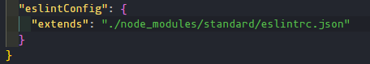

# ESlint

que es Eslint? _"ESLint es una herramienta de análisis de código estático de código abierto para JavaScript. Se utiliza para identificar y reportar patrones en el código JavaScript, lo que ayuda a mejorar la calidad y consistencia del código en un proyecto."_-chatGPT
en pocas palabras ESlint es como un autocorrector para codigo te ayuda a dare un estylo a tu codigo

## instalar ESlint

para instalar ESlint se hace como se instala cualquier dependencia de desarollo de npm con el comando `npm install eslint -D`

## configuarar ESlint

para configurar eslint con un perfil por defecto podemos usar el comando `eslint --init`

1. la primera preguna que nos hara es ¿Cómo le gustaría usar ESLint? la que mejor va acorde a nuestros requerimientos es **To check syntax, find problems, and enforce code style** que lo que haria seria checar la sintaxis solucionar problemas y obligarnos a usar un solo estilo de codigo

2. luego nos hara unas preguntas acorde a nuestro proyecto

3. ¿Cómo te gustaría definir un estilo para tu proyecto? esto significa si queremos un stilo popular de codigo o uno que nosotros creemos

4. Al final depende de lo que elejimos nos creara un archivo con el nombre **.eslintrc**


## identificar los errores 

para identificar los errores que se generan con ESlinter podemos usar la extension o el comando ```eslint .```


## usar configuraciones ya creadas 

tambien podemos usar configuraciones que ya existen como un ejemplo pude ser standard 

para instalarlo utilizamos el comando ```npm install standard -D ``` con esto ya no nececitamos un eslintrc y solo agregamos lo siguiente en el package.json

