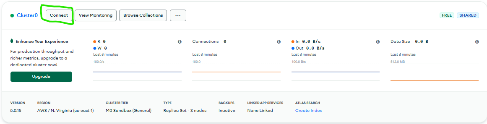
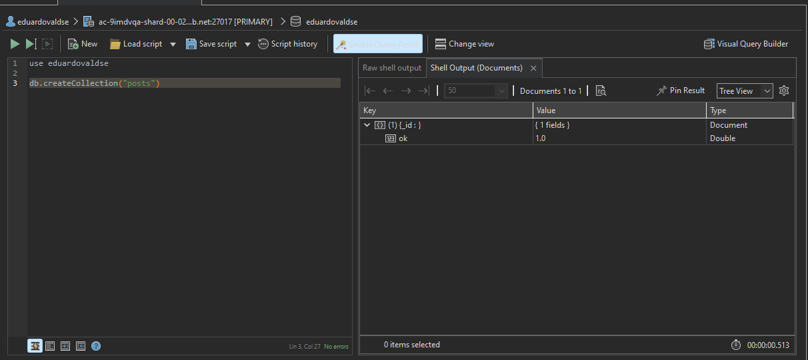
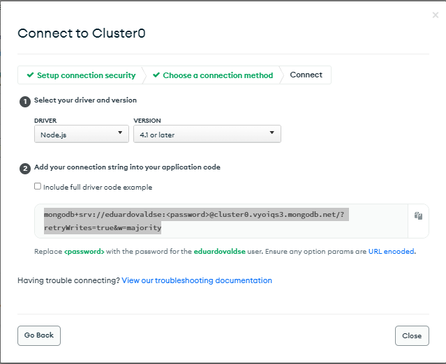
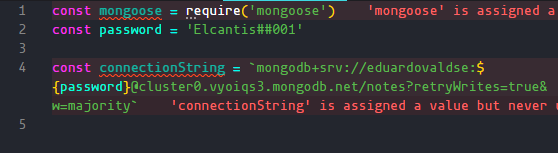
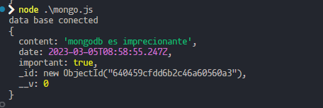

# MongoDB

que es MongoDB? Es una base de datos no SQL por lo que esta basada en documentos que es la eleccion mas pocpular cuando se trabaja con javaScript

## Como crear tu primera DB en ModgoDB

primero tenemos que crear un cluster en la pagina web de MongoDB lo cual nos proporcionara una base de datos de prueba gratis luego tenemos que conectar 



luego nos dara opciones para conectarnos pero bamos usar la opcion de conect to your app

hay diferentes programas/aplicaione para conectarnos a MongoDB pero vamos a usar Studio 3T que es facil y buena para esto nomas tenemos que copiar el link

luego nos bamos al shell y tenemos que indicar que queremos usar ni la local ni la main tenemos que usar la nuestra con el comando 

``` use "nombre de nuestra dbs"  ```

para terminar de crearla tenemos que crear una coleccion con el comando 

``` db.createCollection(name,options) ```

<FONT color="red">Nota: por regla las colecciones llevn nombres en plural por ejemplo post = posts</FONT>


## Creando una dbs

el primer paso es crear una coleccion en este caso 

```MongoDB
    use eduardovaldse

    db.createCollection("posts")
```



### incertar datos en la base de datos
para insertar datos usamos el metodo **insert({})**

```
    db.posts.insert({
        id:2,
        name:"pedaso de post"
    })
```

<FONT color="red">Nota: es incesario crear una id ya que MongoDB te crea una por default</FONT>

<FONT color="red">Nota: como MongoDB no infiere nuestros esquema pueden ser diferentes en cada documento por ejemplo uno tener 5 elementos enbes de 2</FONT>

###  Hacer una consulta

podemos hacer una consulta con el metodo **find()**

``` db.posts.find() ```

## Acutalizar 

si queremos actualisar un valor podemos usar el comando **update()** de la siguiente maner 

```
db.phtos.update({user:"@grodonchis"},{
    $set: {
        name: "@gordonchisDEV"
    }
})
```

# Mongoose

Que es mongoose?_"Mongoose es una herramienta de modelado de objetos MongoDB diseñada para trabajar en un entorno asíncrono. Mongoose es compatible con Node.js y Deno (alfa). Es una biblioteca ODM (Object Data Modeling) para MongoDB."_-chatgpt
en pocas palabras esta aplicaion nos va a permitir definir un esquema en MongoDB y entre mas cosas

para instalar mongoose se hace como cualquier otro paquete de npm 

```npm install mongoose ``` 

## Conectar aplicacion a base de datos

para conectar aplicaion a nuestra base de datos tenemos que recuperar de la pagina web de MongoDB el conexionString



y en en nuestro codigo tenemos que agragar lo siguiente



para conectar tenemos que agregar la siguiente linea

```javascript
    mongoose.connect(connectionString, {useNewUrlParser: true}).then(() => console.log("DB conected"))
```
esto regresa una promesa por lo que tenemos que resolverla con then


## Definir esquema
que es un esquema?_"Un esquema en Mongoose es una estructura JSON que contiene información acerca de las propiedades de un documento. Puede también contener información acerca de la validación y de los valores por default, y si una propiedad en particular es requerida"_-bingCHAT 
osea es predefinr un estilo de nuestra vase de datos


para crear un esquema tenemos que usar el siguiente codigo
```javascript 
const noteSchema = new mongoose.Schema(
{ 
    content: String,//esto significa que content siempre va a a hser un string
    date: Date,
    important: Boolean 
})
```
en este ejemplo es un esquema para una nota 

<FONT color="red">Nota: estos esquemas son a nivel de applicacion por lo que si queremos ir a la base de datos y definir insertar un dato con diferente esquema lo podemos hacer</FONT>

## Crear modelo

una ves ya creamos un esquema tenemos que crear un modelo osea que vamos a crear el modelo final que se va a subir a la base de datos

para crear un modelo tenemos que usar la funcion model donde vamos a pasar el nombre del modelo y el esquema que es el que isimos en el paso anterior

```javascript 
const Note = mongoose.model('Note', noteSchema)//aqui definimos el modelo

const note = new Note({
  content: 'mongodb es imprecionante',
  date: new Date(),
  important: true
})//creamos la primera nota

note.save().then(result => {
    mongoose.connecton.close()//esto es una buena practica cerrar la conexion
    console.log(result)
}).cath(err => console.error(err))//aqui guardamos la nota en la db
```


este deveria de ser el output

<FONT color="red">Nota: los nombres de los modelos **siempre va en singular y en mayuscula la primer letra**</FONT>

## Buscar datos
para buscar datos desde nuestro documento podemos usar el comando ```find```

```javascript
    Note.find({}).then(
        (res)=> console.log(res);
        mongoose.connection.close()
    )
```
y esto nos devolvera los objetos que buscamos
