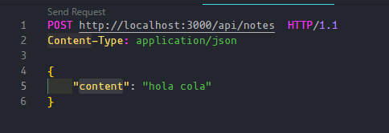
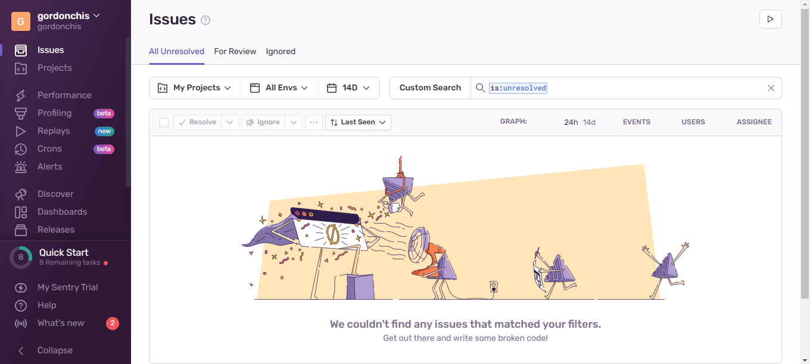
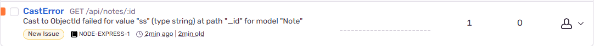

## INDICE

<!-- vscode-markdown-toc -->
* 1. [Iniciar proyecto con npm](#Iniciarproyectoconnpm)
* 2. [Ejecutar archivo con nodeJS](#EjecutararchivoconnodeJS)
	* 2.1. [Ejecutar con scripts](#Ejecutarconscripts)
* 3. [Primer servidor con nodeJS](#PrimerservidorconnodeJS)
* 4. [Pasar objetos en un response](#Pasarobjetosenunresponse)
* 5. [content type](#contenttype)
* 6. [Nodemon](#Nodemon)
* 7. [que es express? y porque express?](#queesexpressyporqueexpress)
* 8. [Express](#Express)
* 9. [semantica en las versiones de package](#semanticaenlasversionesdepackage)
* 10. [api res](#apires)
* 11. [Devolver todas los elementos](#Devolvertodasloselementos)
* 12. [Debolviendo elementos por id dinamica](#Debolviendoelementosporiddinamica)
* 13. [haciendo delete a elemetos](#haciendodeleteaelemetos)
* 14. [[**Imnsomnia**](https://insomnia.rest/)](#Imnsomniahttps:insomnia.rest)
* 15. [Rest client in visual studio code](#Restclientinvisualstudiocode)
* 16. [agregar nota con POST](#agregarnotaconPOST)
* 17. [middlewares en express](#middlewaresenexpress)
* 18. [Problemas de CORS(Cross-Origin Resource Sharing)](#ProblemasdeCORSCross-OriginResourceSharing)
* 19. [Deployar nuestra API en Heroku](#DeployarnuestraAPIenHeroku)
* 20. [diccionario](#diccionario)

<!-- vscode-markdown-toc-config
	numbering=true
	autoSave=true
	/vscode-markdown-toc-config -->
<!-- /vscode-markdown-toc --># INDICE

  


# Node.js

que es nodejs?Es un entorno de ejecucion de codigo de lado del para ejecutar codigo de javaScript _"Node.js se basa en el motor de JavaScript V8 de Google, que se utiliza en el navegador web Google Chrome. Sin embargo, en lugar de ejecutar JavaScript en el navegador, Node.js permite a los desarrolladores ejecutar JavaScript en el servidor, lo que les brinda una gran flexibilidad y eficiencia en la creación de aplicaciones en tiempo real y de alta escalabilidad"._-chatGPT

podemos empezar a ejecutar codigo de nodeJS desde la consola solo ejecutando el comando node

##  1. <a name='Iniciarproyectoconnpm'></a>Iniciar proyecto con npm

para iniciar un proyecto de node necesitamos usar npm para esto podemos ejecutar `npm init` lo que nos desplegara una serie de preguntas para omitirla podemos usar `npm init -y `

##  2. <a name='EjecutararchivoconnodeJS'></a>Ejecutar archivo con nodeJS

para ejecutar un archivo desde la terminal podemos usar el comando node seguido de la direccion del archivo `node -file phat`

###  2.1. <a name='Ejecutarconscripts'></a>Ejecutar con scripts

podemos usar el comando que mencionamos en la seccion pasada pero esto a largo plazo no es muy recomendable lo que tenemos que usar son los scripts que estan incluidos en nuestro archivo package.json


para ejecutar estos ecripts tenemos que usar el comando `npm run -nombre de escript` porejemplo `nom run start`

##  3. <a name='PrimerservidorconnodeJS'></a>Primer servidor con nodeJS

para crear un sevidor LOCAL en node js los pasos son los siguienetes

1. importar el modulo http
2. crear un server
3. pasar los parametros de request y response
4. escuchar en el puerto

```js
const http = require("http"); //importamos http

const app = http.createServer((request, response) => {
  //creamos el server
  response.writeHead(200, { "Content-Type": "text/plain" }); //le estamos pasando un status code de 200 y el texto va a ser plano
  response.end("hola mundo"); //texto que vamos a pasar
});

const port = 3000; //puerto

app.listen(port); //empezamos a escuchar el puerto esto significa que vamos a estar pendientes de una peticion en el puerto 3000
```

que es request y response? request y response son los dos parametros que se le pasa a un servidor uno es la peticion que nos indica que nos esta pidiendo el usuario y el response es lo que le vamos a entregar osea que cada que le llege una peticion se va a ejecutar el response

<FONT color="red">Nota: es importante que el puerto que eligamos este libre</FONT>

##  4. <a name='Pasarobjetosenunresponse'></a>Pasar objetos en un response

para pasar un objeto como response no lo podemos pasar asi como si nada tenemos que usar ya que esto causaria un erro lo que tenemos que hacer es combertir cada uno de estos datos a un string de la siguiente manera

```js
const notes = [
  {
    id: 1,
    content:
      "sunt aut facere repellat provident occaecati excepturi optio reprehenderit",
    date: "22/02/23",
    important: true,
  },
  {
    id: 2,
    content: "ea molestias quasi exercitationem repellat qui ipsa sit aut",
    date: "22/02/23",
    important: false,
  },
  {
    id: 3,
    content: "dolorem eum magni eos aperiam quia",
    date: "22/02/23",
    important: true,
  },
];

const app = http.createServer((request, response) => {
  response.writeHead(200, { "Content-Type": "aplication/json" });
  response.end(JSON.stringify(notes)); //lo que esta haciendo es que stringify itera cada uno de los elementos y los combierte a str
});
```

##  5. <a name='contenttype'></a>content type

depende de el tipo de dato que queramos debolver este tiene que tener un conten-type distinto

[**lista completa de content-type**](https://developer.mozilla.org/en-US/docs/Web/HTTP/Basics_of_HTTP/MIME_types/Common_types)

##  6. <a name='Nodemon'></a>Nodemon

que es nodemone? asta haora lo que estamos haciendo cada que queremos ver los cambios de nuestra apllicacion es cerrar el servidor luego volverlo a abrir esto lo podemos solucionar con una dependencia llamada nodemon la cual podemos instalar con el comando `node install nodemon -D`

pata ejecutar tenemos que agregar un script como `"dev":nodemon index.js` o desde la consola `nodemon index.js`

<FONT color="red">Nota: es importante que uses el -D en este tipo de dependencia ya que se refiere a que solo lo vamos a usar en el servidor de desarollo</FONT>

##  7. <a name='queesexpressyporqueexpress'></a>que es express? y porque express?

_Express es un framework de Node.js que proporciona una capa de abstracción sobre el manejo de solicitudes HTTP y la creación de aplicaciones web y APIs. En términos sencillos, Express facilita la construcción de aplicaciones web utilizando Node.js._-chatGPT

##  8. <a name='Express'></a>Express

para empezar a usar express primero tenemos que exportarlo como cualquier otra dependencia

luego tenemos que crear la aplicacion con el siguiente linea de codigo `const app = express()`

luego lo que temos que hacer es indicar que queremos mandar cuando se nos hace un get en el pad / (pagina principal)

```javascript
const express = require("express");
const app = express();

app.get("/", (requets, response) => {
  response.send("<h1>hello</h1>"); //cuando entren al pad regresamos un h1
});
```

podemos poner mas get por ejemplo cuando nuestra aplicacion resive una peticion en /home

```javascript
const express = require("express");
const app = express();

app.get("/home", (requets, response) => {
  response.send("<h1>home</h1>"); //cuando entren al pad regresamos un h1
});
```

para regresar un json podemos usar el `response.json(/_elemento o obj_/)`

en express ay una pequena diferencia cuando arrancamos el proyecto y es que es asincrono por lo que tenemos que poner una funcion con que se leeria como cuando termines de levantar el servidor ejecuta esto

```javascript
const port = 3000;
app.listen(port, () => [console.log("ejecutando")]);
```

##  9. <a name='semanticaenlasversionesdepackage'></a>semantica en las versiones de package

las versiones en elm package.json tienen una semantica eso significa que cada numero tiene un significado por ejemplo en la siguiente version

**^2.0.7**

- el 7 es el parche en el que van osea que no cambia nada solo se arreglo algun bug o otra cosa

- el 0 es el minor que el el del medio eso lo que hace es indicar que tenemos una nueva feature o caracteriztica

- el 2 es la mayor estas son las versiones que cambian por completo el contrato de la dependencia

- el ^ o caret como se llama es que esta dependecia se actualiza automaticamente osea que mas adelante te puede instalar la version 2.0.8 pero nunca te instalaria la 3.0.0

<FONT color ="red">Note: si quieres tener controladas las versiones de las dependencias es nesesario que elimines el caret(^)</FONT>

##  10. <a name='apires'></a>api res

una api res es un tipo de arquitectura de una api _API REST (o RESTful API) es un conjunto de convenciones y prácticas para construir y exponer servicios web que utilizan el protocolo HTTP para permitir la comunicación y el intercambio de datos entre aplicaciones. REST significa Representational State Transfer y se basa en el concepto de recursos, que son identificadores únicos para información o datos que se pueden acceder y manipular a través de una interfaz uniforme._-chatGPT

osea que ay un solo link para todo un tema por ejemplo si estamos hablando de notas nuestro unica direccion para todo tanto como get o para post seria /api/notes

# Creando api res

##  11. <a name='Devolvertodasloselementos'></a>Devolver todas los elementos

```js
const http = require("http");
const express = require("express");
const app = express();

const notes = [
  {
    id: 1,
    content:
      "sunt aut facere repellat provident occaecati excepturi optio reprehenderit",
    date: "22/02/23",
    important: true,
  },
  {
    id: 2,
    content: "ea molestias quasi exercitationem repellat qui ipsa sit aut",
    date: "22/02/23",
    important: false,
  },
  {
    id: 3,
    content: "dolorem eum magni eos aperiam quia holas",
    date: "22/02/23",
    important: true,
  },
];

app.get("/api/notes", (requets, response) => {
  response.json(notes);
});

const port = 3000;
app.listen(port, () => [console.log(`live server in port ${port}`)]);
```

con este codigo ya estariamos debolbiendo todas las notas pero y si queremos debolver solo una

##  12. <a name='Debolviendoelementosporiddinamica'></a>Debolviendo elementos por id dinamica

primero tenemos que poner en la direciion algo que sea dincamico osea que sea como un identificador unico lugo tenemos que recuperarlo en el request de la siguiente manera para luego poner un filtro o una busqueda aver si existe esa id en una nota

```js
app.get("/api/notes/:id", (requets, response) => {
  const id = Number(requets.params.id); //recuperamos el id
  const filtro = notes.find((note) => note.id === id); //esto es un filtro para ver si existe

  response.json(note); //regresamos solo la nota que coincide
});
```

como id es dinamico si yo escrivo /api/notes/7193278173 el id seria el ultimo numero

tambien podemos hacer un filtro por si no encuentra el elemento como el diguiente

```javascript
if (note) {
  response.json(note);
} else {
  resposne.status(404).end;
}
```

##  13. <a name='haciendodeleteaelemetos'></a>haciendo delete a elemetos

hasta aqui ya podemos llamar a solo uno pero que tal si queremos borrar un elemento en este caso una nota

para esto tenemso que cambiar la accion que es **_.get_** por **delete** luego tenemos que hacer un filtro que seria el siguiente `notes = notes.filter(note => note.id !=== id)` **lo que esta diciendo es recuperame todas las notas en un nuevo obj menos la que quiero borrar**

```javascript
const notes = [
  {
    id: 1,
    content:
      "sunt aut facere repellat provident occaecati excepturi optio reprehenderit",
    date: "22/02/23",
    important: true,
  },
  {
    id: 2,
    content: "ea molestias quasi exercitationem repellat qui ipsa sit aut",
    date: "22/02/23",
    important: false,
  },
  {
    id: 3,
    content: "dolorem eum magni eos aperiam quia holas",
    date: "22/02/23",
    important: true,
  },
];
app.delete("/api/notes/:id", (request, response) => {
  const id = Number(requets.params.id); //recuperar id dinamica

  notes = notes.filter((note) => note.id !== id); //recupera todas las notas en un nuevo obj menos el que quiero borrar
  response.status(204).end(); //mandamos un estado 204 a la respuesta
});
```

pero como hacemos un delet si cuando ponemos la direccion se va aborrar pues para esto hay dos erramientas...

una puede ser [**postman**](https://www.postman.com/)

pero vamos a usar

##  14. <a name='Imnsomniahttps:insomnia.rest'></a>[**Imnsomnia**](https://insomnia.rest/)

Esta aplicacion es muy sencilla ya que la podemos aprender a usar con intuicion

pero lo importante esta aqui lo de verde es la accion y el boton es para mandar a la direccion que indicamos


para eleminar una solo vasta con indicar la url y el id y esta se eliminara

<small>ya no existe la nota 1</small>

##  15. <a name='Restclientinvisualstudiocode'></a>Rest client in visual studio code

esta es una extencion de visual estudio code y es muy util por que en esta si alguien mas quiere hacer una peticion para probar puedes hacerla desde un documento aparte con la extencion .rest

para hecer esto tenemos que agregar un archivo que termine con la extencion **.rest** en el tenemos que indicar el metodo que queremos y en la esquina superior izquierda no aparecera para mandar la peticion

```rest
  //recuperar todas las notas
  GET http://localhost:3000/api/notes/
```

para hacer un post tenemos que pasar el objeto


<i>esto es lo que deveria contener un post</i>


##  16. <a name='agregarnotaconPOST'></a>agregar nota con POST

para hacer esto tenemos que usar el metodo **post**

1. primero tenemos que recuperar la nota que nos manda la cual se entuentra en el body de la request

2. tenmos que hacer el post pasando el obj

3. tenemos que recuperar las notas generar lo que tengamos que generar y concatenar con nuestro obj y regresamos la nueva nota

```javascript
app.post("/api/notes", (request, response) => {
  const note = request.body; //recuperamos el body

  const ids = notes.map((note) => note.id); //creamos una id
  const maxIds = Math.max(...ids);

  const newNote = {
    id: maxIds + 1, //sumamos al id mas alto mas uno
    content: note.content, //creamos el contenido
    imporant: typeof note.imporant !== "undefined" ? note.imporant : false,
    date: new Date().toISOString(), //creamos una fecha
  };

  notes = [...notes, newNote]; // esto es lo equivalente al concat

  response.json(newNote); //regresamos la nueva nota(o el objeto final)
});
```


<i>esto es lo que deveria contener un post</i>

<FONT color="red">Nota: antes teniamos que instalar a mano un parse de json pero en las verciones actuales de express esto ya no es nesesario</FONT>

<i>esto temos que usar para el parse por defecto de express</i>

<FONT color="red">Nota: la id como si tenemos un date(fecha) no se tiene que pasar por una post ya que estas se deverian de generar la misma api _**entre menos contenido le pasemos a una api mejor**_ </FONT>


##  17. <a name='middlewaresenexpress'></a>middlewares en express

que es un middleware? un middleware es una funcion que intersepta la peticion que esta pasando por tu api 

para usar esto tenemos que usar la palabra clave **use** que significa que cualquier accion ya sea un get un post o un delete va a pasar por esta funcion osea que siempre se va a ejecutar

pdemso hacer lo que sea para recuperar datos de la request pero siempre al ultimo tenemos que indicar que siga con la funcion **next()** si no ponemos esto se quedara atascado en la funcion

```js
  app.use(request, response, next) => {
    console.log(request.method)// aqui pedimos el metodo que quiere usar ej. GET POST DELETE
    console.log(request.path)//aqui a que direccion ej. /api/notes/1
    console.log(request.body)//aqui el cuerpo si no tiene nos devolvera un obj vasio
    next()// aqui indicamos que siga a otro checkpoint
  }

  app.use((request, response,next)){
    console.log("segundo checkpoint")//despues pasa por aqui
    next()
  }
```

esto es muy util para crear un 404 ya que si no entra en ninguno se va a ir por la ultima opccion

##  18. <a name='ProblemasdeCORSCross-OriginResourceSharing'></a>Problemas de CORS(Cross-Origin Resource Sharing)

Que es el cors? "El problema CORS se refiere a una situación en la que una aplicación web basada en navegador intenta acceder a recursos que están en otro dominio y el servidor no permite esa comunicación"-Bing Chat.
**En pocas palabras el problma es que la api esta en otro dominio y el backend de ella no espicifico quienes pueden hacceder a esta osea que otro dominio pueda acceder a ella** para solucionar:

- existe un middelwer para esto el cual se instala usando ```npm install cors``` es una dependencia de produccion no de desarollo


- para usar lo tenemos que requerir en el documento como cualquier otra dependencia ```const cors = require('cors')```

- **para usar este middleware tenemos que simplemente usarlo ```app.use(cors())``` esto por defecto dejara pasar todos los origenes pero tiene infinitas configuraciones**

<FONT color="red">Nota: Este middleware no lo uses como metodo de seguridad para tu API ya que es muy facil de hackear</FONT>

##  19. <a name='DeployarnuestraAPIenHeroku'></a>Deployar nuestra API en Heroku

1. El primer paso para deployar nuestra API es hacer un repositorio de gitHub con todos los archivos de la api

2. Segundo paso es crear un archivo llamado procfile donde tenemos que indicar que tipo de servicio queremos deployar y el comando que tiene que ejecutar para ejecutar la api o aplicacion en este caso seria 

```Procfile 
  web: npm start
```

3. Tercer paso tenemos que cambiar en nuestro archivo el port ya que heroku nos va a asignar uno podemos hacer un or porsi no exitste 

```JS
 const PORT = process.env.PORT || 3001 
```

3. luego tenos que crear la aplicaion en la terminal con el seigiente comando

```powershell
  heroku create
```

esto nos ba a regresar una URL que vamos a utilizar pero en este momento aun no contiene nuestra app

4. para el paso sigiente heroku nos regresara un nuevo repositorio remto en git llamado heroku lo que tendriamos que hacer es usar el tipico comando de puish pero enves de pushearlo en el origen lo pushariamos en heroku

```git
  git push -u heroku master
```
cuando agamos esto se instalara en el remoto de heroku todos los archivos 

5. 


<FONT color="red">Nota: para realizar el tercer paso tenemos que tener instalado [Heroku CLI](https://devcenter.heroku.com/articles/heroku-cli)</FONT>


##  20. <a name='diccionario'></a>diccionario

- variavles de entorno: una variable de entorno son variables que no estan en nuestra aplicacion si no en nuestro sistema operativo una forma de pasar variables de entorno es en la terminal o usando un archivo .env pero si queremos usar esta maner tenemos que descragar dependencia llamada dotenv
```javascript
  const PORT = process.env.PORT
```


## utilisando middlewares para manejar errores en Express

podemos utilizar middlewares para manejar los errores en Express porejemplo en el siguiente ejemplo se muestra una peticion a una vase de datos y si la base de datos falla vamos a hacer un next cual es la rason si alguien ase un get y nuestro database no esta dispnible ba a pasar asta otro get donde tampoco funcionara y pasara asta llegar a el middleware donde regresaremos el error

```javascript
app.get('/api/notes/:id', (requets, response, next) => {
  const { id } = requets.params

  Note.findById(id).then(note => {
    if (note) {
      return response.json(note)
    } else {
      response.status(404).end()
    }
  }
  ).catch(err => {
    next(err)// va a salatar al proximo asta llegar al middleware
  })
})

app.use((error, requets, response, next) => {
  if (error.name === 'CastError') {//si el error.name es igual a catsError regresa
    response.status(400).send({error: "id is bad "}).end()//codigo 500
  }else{
    response.status(500).end
  }
})
```

<FONT color="red">Nota: es muy importante cuidar el orden de los middleware ya que si pondemos un middleware arriva de una peticion esta no se llevara acabo y sera interseptada la peticion por el middleware</FONT>

## Manejo de errores con **Sentry.io**

Que es sentry?__Sentry se presenta como un “Error Tracking Software” y permite a tu equipo encontrar y corregir rápidamente errores en producción de tu aplicación web1. Con la información que proporciona Sentry, puedes filtrar, reproducir y resolver los errores con la máxima visibilidad, lo que aporta una eficiencia extraordinaria en la comprensión del problema__
en pocas palabaras nos ayudara a monitoriar nuestros errores y mejorar el rendimiento de nuestro codigo

Como usar sentry? para empezar a usar sentry tenemos que registrarnos en la pagina web luego tenemos que instalar la dependencia

1.  Despues de instalar y requerir las depenedencias tenemos que iniciar en el codigo sentry con las siguientes lineas de codigo

```javascript
Sentry.init({
  dsn: 'https://e02719f6211a4011b43cfa12c274caa9@o4504817975164928.ingest.sentry.io/4504817976868869',
  integrations: [
    // enable HTTP calls tracing
    new Sentry.Integrations.Http({ tracing: true }),
    // enable Express.js middleware tracing
    new Tracing.Integrations.Express({ app })
  ],

  // Set tracesSampleRate to 1.0 to capture 100%
  // of transactions for performance monitoring.
  // We recommend adjusting this value in production
  tracesSampleRate: 1.0
})
```

2. tenemos que poner todos los middleware de Sentry pero siguiendo el orden que indica la pagina de la suigiente manera

```javascript
app.use(Sentry.Handlers.requestHandler());
app.use(Sentry.Handlers.tracingHandler());
//esos 2 antes de cada request 

app.use(Sentry.Handlers.errorHandler());//este debe ir despues de los request pero antes de tus middlewar que controlan errores 
```


desde esta pagina podemos monitoriar todos los errores de nuestro codigo


[Sentry web page](https://gordonchis.sentry.io/issues/?referrer=sidebar)

## sirviendo staticos con express

algo statico es algo que nunca va a cambiar por ejemplo  puede ser unas imagenes o cualquier cosa para almacenar esto en express y servirlo podemos usar middleware de la siguiente manera 

```javascript
app.use(express.static('img'))//pasamos la ruta de la carpeta estatica
```