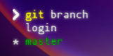

# que es git???

git es un sitema de control de versiones (VCS) version control system

- Administra o controla las versiones de un programa

* te permite cordinar el trabjo con otros desarolladores

* pero simepre podiendo retroseder haciendo un regitro de las versiones anteriores

* puedes ver quien y cuando modifico el codigo

* local & remote repos

# conseptos de git

- te prove una manera de siegir los cambios al codigo

- esto lo hace con una manera llamada **snapshots** que es una especie de capturas de ti codigo para poder regresar a ese punto

- tu puedes visitar cualquier snashot en cualquier punto

# Estados de git

en git hay 3 estados que es

- **_working directory_**: que es donde nosotros trbajamos con nuestros archivos

- **_staging area_**: aqui es donde agregamos los archivos que estamos preparando para el guardado

- **\_repository**\_: cuando ya estamos desididos de hacer el cambio que agregamos en staging area lo pasamos a este nivel

# comandos basicos

- **_git init_**: es para indicar que vamos a crear un nuevo proyecto o que ya tenemos un proyecto pero queremos usar git

* **_git add <file>_**: es para poder pasar los archivos del working directory a stagning area (en el espasio file agregamos la direccion del archivo)

* **_git status_**: es para ver en que estado se encuentra los archivos

* **_git commit_**: es para pasar los archivos de staning area a repository es para crear un primer **snapshot**

* **_git push_**: es para subir a un repositorio remoto

* **_git pull_**: es para agregar los cambios que an echo otros desarolladores

* **_git clone_**: hace una copia del servidor central a tu ordenador

# primer commit

para hacer nuestro primer commit solo basta con indicar en consola **git comit** esto nos hara nuestro primer commit

Nota: si queremos no avrir un archivo podemos usar lo sigiente` git commit -m "nombre del commit"`

cuando agamos nuestro primer commit podemos indicar con **git log** para ver nuestra seed o nuestro id de esa commit

# regreasar a un antiguo commit

cuando queremos hacemos una modificacion a nuestro codigo se y usamos nuevamente el comando **_git status_** nos indicara que isimos un cambio de la sigiente manera

para regresar a los antiguos cambios tenemos que usar el comando `**git checkout --file name**` y automatica mente en el archivo se regresara al ultimo snapshot

NOTA: Si nosotros no hacemos un snapshot antes de regresar al commit anterior no ay forma de volver a ese punto del archivo

# git diff

tambien podemos ver las diferencias entre un snapshot pasado y nuestro documento actual con **git diff**

# guardar cambios

para guardar los cambios tenemos que volver a usar `git add -file name`

esto significa que ya esta en working directory pero para guardarlo podemos hacer un snapshot nuevo

ahora si hacemos un **_git log_** podemos ver dos snapshots o commits

el snapshot que incluya el texto **HEAD -> master** es el codigo en el que estamos parados o en el que estamos trabajando

# ignorar documentos

en git existe algo que se llama **.gitignore** que es un documento en el que tenos que introducir todos los archivos que queremos que ignore osea que no tendarn nigun imapcto en el status de git

Nota: El archivo .gitignore si se tiene que agregar

# git branch

git branch nos permite crear versiones alternativas de nuestra version main o vase

para ver todas las versiones alternativas o ramas podemos usar **git branch**

para movernos adentro de otra version alternativa podemos usar `git checkout "nombre de la rama"`

si nosotros hacemos un snapshot en una rama no estara en la version vase o otras versiones

# conexion entre git y gitHub

para subir nuestro codigo a git
Hub primero tenemos que crear un repositorio en la pagina de github
para hacer nuestro repositorio remoto tenemos que usar `git remote add origin URL del repo`

luego hacer push o meter los archivos a nuestro repositorio con el comando `git push -u origin nombre de la rama` si hacemos esto bien git subira nuestro codigo y ya tenemos nuestro repositorio de github

# github README.md

este archivo sirve para ayudar a las personas que quieren leer nuestro codigo a entenderlo ya sea poniendo gias o explicaciones en el este archivo no modifica nuestro codigo solo agrega un pide de pagina a gitHub

# eliminar archivo de el repositorio

para eliminar un archivo de un repositorio tenemos que eliminarlo de forma local luego hacer `git add en el archivo eliminado` aunque ya no exista luego tenemos que hacer un `git pull` para final mente hacer un `git push` en el servidor

Nota: podemos usar git rm nombre de archivo para omitir esto

# recuperar archivo eliminado

para recuperar un archivp que eliminamos podemos usar `git --restore nombre del archivo`

# TIPS

- **_git satus mejorado_**: podemos usar un git status mejorado usando el comando **_git status -s_**

* **_git log mejorado_**: para usar un git log mas limpio podemos usar **_git log --oneline_**
